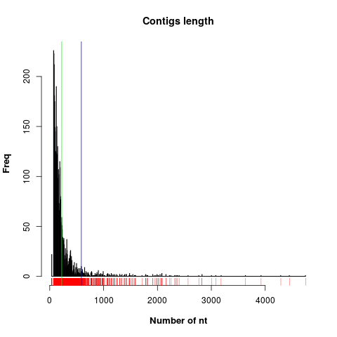

# Fastq sequences assembly

This repository provides scripts used to perform quality control and 
assembly of fastq *Solexa* sequences from **Illumina** platform. The 
pipeline is implemented using the nextflow tool.

## Introduction

The pipeline performs the following tasks:

* **Quality control**
* **Sequence filtering**
* **Sequences assembly**

Here, we describe the files and directories in this repository:

* pipeline - main pipeline script implemented using nextflow.
* pipeLine.R - R script containing optional data quality and filtering
routines.
* alignments - contain aligned sequences in fasta format.
* figures - figures shown here.
* filteredData - filtered fastq data. 
* genomes - contain the reference genome (*Giardia lamblia*).
* indexes - reference genome files to align sequences.
* qreports - quality control reports files.
* assemblyReport.R - script to analyze the length of contigs. Used to 
contruct the figure 2.
* nextflow - tool for pipeline management (see dependencies).
* folder_description.txt - fuller description of the content of each directory is given in this file.


## 0. Running this pipeline

## 0.1 Pipeline dependencies

In order to reproduce the pipeline presented here you must clone the github repository and then go to the directory of the cloned repository by executing 
the following commands on a linux shell. 

```r
git clone https://github.com/caramirezal/ensambleDeSequenciasFastq.git
cd ensambleDeSequenciasFastq
``` 

From now on, it is assumed that the current directory is that of the
cloned repository. Additionally, the following tools must be previously installed. 

* [nextflow](https://www.nextflow.io/) - type 
`curl -s https://get.nextflow.io | bash ` 
* [FaQCs](https://github.com/LANL-Bioinformatics/FaQCs) - clone
in the current repository executing `git clone https://github.com/LANL-Bioinformatics/FaQCs.git`
* [cutadapt](http://cutadapt.readthedocs.io/en/stable/index.html) -
see installation manual [here](http://cutadapt.readthedocs.io/en/stable/installation.html).
* [RQC](https://bioconductor.org/packages/devel/bioc/vignettes/Rqc/inst/doc/Rqc.html) - r Package *(Optional)*.
* [abyss](https://github.com/bcgsc/abyss) -  run `sudo apt-get install abyss` on linux shell.


## 0.2 Preparing data
 
The next step is to specify your local paths. You can do this
by openning the "pipeline" nextflow text file and change the path0,
path1, and path2 to your current directory, first, and second fastq
files local paths, respectively. In my case the head of the pipeline file
is the following:

```r
path0 = "/home/carlos/scripts/ensambleDeSequenciasFastq/"
path1 = "/home/carlos/scripts/ensambleDeSequenciasFastq/data/Illumina1.fq.gz"
path2 = "/home/carlos/scripts/ensambleDeSequenciasFastq/data/Illumina2.fq.gz"
```

Once this is done, the pipeline nextflow script can be executed by running
the following command on the current cloned directory:

```r
./nextflow run pipeline
```

The pipeline performs the routines described in the following 
sections.


## 1. Quality control 

Control quality was evaluated by the analysis of quality scores in
fastq sequences. The next figure shows the frequency of reads with
a given Qscore and nucleotide position (left) and quality *vs* position
(right). 


The figure was generated using
[FaQCs](https://github.com/LANL-Bioinformatics/FaQCs) tool. The reports are
implemented in the pipeline file as follows: 

```r
perl $path0/FaQCs/FaQCs.pl -p $path1 $path2 -d $path0/qreports/ -qc_only
```

The main output of this script is the QC_qc_report.pdf quality control 
file and is saved in the qreport directory. Optionally, RQC Rlibrary
quality control plots can be generated by uncommenting the 
following line in the pipeline file.

```r
Rscript pipeLine.R
```


## 2. Data filtering

In order to improve the quality of the data used for the assembly the following 
filter steps were perfomed: *i*) Illumina truSeq 3' adapters were trimmed 
from both pair-end reads, *ii*) reads with less than 36 nt, and iii) reads
having N values were removed. This routine was performed using [cutadapt](http://cutadapt.readthedocs.io/en/stable/index.html) with the next piece of 
code of the pipeline file:

```r
cutadapt \
             -a AGATCGGAAGAGCACACGTCTGAACTCCAGTCAC \
             -A AGATCGGAAGAGCGTCGTGTAGGGAAAGAGTGTAGATCTCGGTGGTCGCCGTATCATT \
             -o $path0/filteredData/Illumina1_filt.fastq -p $path0/filteredData/Illumina2_filt.fastq  \
             $path0/data/Illumina1.fq.gz $path0/data/Illumina2.fq.gz  \
             -m 36 \
             --max-n 1  > $path0/filteredData/filt_report.txt
```

The outputs are fastq filtered sequences. In this case Illumina1_filt.fastq and Illumina2_filt.fastq. These files are stored in the filteredData directory. A summary of the process is given in the filt_report.txt file.


## 3. Sequences assembly

The trimmed and filtered sequences obtained so far were assembled
into contigs. The routine was carried out using [abyss](https://github.com/bcgsc/abyss) tool. The next code is implemented in the pipeline script.

```r
abyss-pe name=assignment K=10 k=36 \
              in='$path0/filteredData/Illumina1_filt.fastq $path0/filteredData/Illumina2_filt.fastq' \
              B=100M H=1 kc=3 \
              --directory=$path0/alignments
```
 
The output aligned sequences in fasta format are exported into the
alignments directory. The length of the aligned sequences are shown in the next figure.



The routine to process the data and plot the previous figure is 
given in the assemblyReport.R script. 

The parameter K was optimized in order to maximize the length mean of the
contigs. The process was implemented as follows.

```
##K parameter optimization
## uncomment this section and replace by your local
## paths to fastq files
for i in 10 11 12 13 14 15
        do
        mkdir $path0/alignments/K$i
        abyss-pe name=assignment K=$i k=36 in='/home/carlos/scripts/#ensambleDeSequenciasFastq//filteredData/Illumina1_filt.fastq /home/carlos/#scripts/ensambleDeSequenciasFastq//filteredData/Illumina2_filt.fastq' B=100M H=1 kc=3 --directory=/home/carlos/scripts/ensambleDeSequenciasFastq//#alignments/K$i
         echo $i
done
```


## Bonus. Anotation to reference genome

**Work at progress**: Ongoing work is being carried out to align the
assembled contigs sequences to reference libraries. The following 
routines are already implemented in the pipeline script.

```r
## fastq to sam
bowtie2 -x ~/scripts/ensambleDeSequenciasFastq/indexes/indexGiardia -1 data/fastq/Illumina1.fq -2 data/fastq/Illumina2.fq -S alignments/output.sam
bowtie2 -x indexes/giardia_ref -1 data/fastq/Illumina1.fq -2 data/fastq/Illumina2.fq -S alignments/output.sam
  
## sam to bam conversion
./scripts/samtools/samtools view -b -S -o scripts/ensambleDeSequenciasFastq/alignments/output.bam scripts/ensambleDeSequenciasFastq/alignments/output.sam
samtools view -b -S -o alignments/output.bam alignments/output.sam
  
## sorting bam file
./scripts/samtools/samtools sort scripts/ensambleDeSequenciasFastq/alignments/output.bam -o scripts/ensambleDeSequenciasFastq/alignments/sorted_output
  
## indexing bam file
./scripts/samtools/samtools index scripts/ensambleDeSequenciasFastq/alignments/sorted_output.bam
  
## bam to fasta
samtools bam2fq alignments/sorted_output | seqtk seq -A - > alignments/output.fq
 
## bam to bed
bedtools bamtobed -i scripts/ensambleDeSequenciasFastq/alignments/sorted_output.bam | head -3
```

Blast searches with longer assembled sequences result from
the assembled process were used to identify specie relationship.
The best scores associate the provided sequences to *Giardia Lamblia*
protozoa.
Hence, the sequences were aligned to the [*Giardia lamblia*](https://www.ncbi.nlm.nih.gov/genome/genomes/26?) reference genome. 

